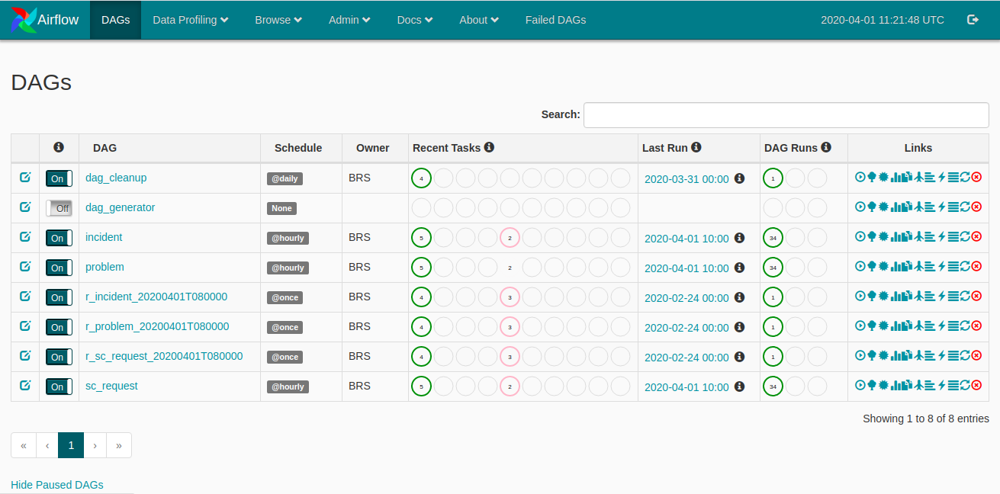

# CIP - mini-BRS

[](https://travis-ci.org/Cloud-Innovation-Partners/miniBRS)   

mini-BRS is a tool that provides ServiceNow data backup facility via programmatic workflows scheduled and monitored
by Apache Airflow. It uses Airflow in back end as workflow management tool.

It provides workflows (DAGs) that helps in getting ServiceNow data exported regularly. You can use existing DAGs or can create your own custom DAGs, mini-BRS provides you a scalable platform which helps you with the
ingestion of ServiceNow data to any cloud or local network storage.

**Table of Contents**

* [Requirements](#requirements)
* [Things to keep handy !](#things-to-keep-handy-!)
* [Getting started](#getting-started)
* [User Interface](#user-interface)
* [How to Use](#how-to-use)
* [Hooks & Operators](#hooks-&-operators)
* [Who Maintains mini-BRS](#who-maintains-mini-brs)


## Requirements

mini-BRS is tested with:

### Master version

* Python versions: 3.6.9
* Postgres DB: 10.12
* MySQL DB: 8.0
* Sqlite - latest stable (it is used mainly for development purpose)

mini-BRS is tested on

* OS Ubuntu 18.04 - minimum 1 GiB memory & 8 GiB storage.

## Things to keep handy !

mini-BRS has an installer script associated with it that helps you in getting right things installed on your system. 
We encourage use of installer for installing mini-BRS. The installer is interactive as it requires user information to get things configured rightly. Please make sure you have following information in hand, so that you don't 
get stuck during installation process.
* Do you want to install mini-BRS as a service on your server or you just require it to be started manually ?
* mini-BRS requires database for its functioning, for this purpose you need to keep the, database *host ip*,
*username*, *password*, *port*, *database name* in hand.
* If you want to have email alerts, make sure you have SMTP server details like *smtp_host*, *smtp_port*, *email address* and *password* in handy. If you want to use Gmail, Outlook or any other email provider make sure you generate `app password` for that email address. In order to know how to generate `app password` for your email address, refer
[create and use app passwords](https://support.google.com/accounts/answer/185833?hl=en)  

## Getting started

**Installation**

1. clone the repository using git

```bash
~$ git clone https://github.com/Cloud-Innovation-Partners/miniBRS.git
```

2. execute ```install``` script inside the project folder using ```sudo``` command

```bash
~$ sudo ./install
```

Installation script will take care of your needs, it will start downloading the dependencies and requirements for the
project. During installation you will need to provide various information such as,

1. Installer will prompt you for type of installation to you need, you can either install mini-BRS as a ubuntu service or you can let the installer create a python virtual environment for you.

2. Next installer will ask you for the type of database to be used as a meta-database for Airflow, mini-BRS is tested
for SQLite, MySQL and Postgres. You can choose the type of database and provide the specific database credentials during 
installation.

3. mini-BRS provide failure alerts option via email, you can provide the SMTP server to be used for sending failure notifications, incase, workflows fail. You can choose to skip this step, If you don't want email alerts.

4. You will be prompted to create your Airflow UI login credentials, by default username is ```admin``` you can keep the default username and add a password to it.

Once installation is over, if you have chosen to install mini-BRS as service than after installation you will have two
system services installed one for ```airflow-webserver``` and other for ```airflow-scheduler``` active and running on
your machine. You can check the status of the service by

```bash
~$ sudo service airflow-websever status
``` 


```bash
~$ sudo service airflow-scheduler status
``` 

If you have installed mini-BRS as a python virtual environment then you will be having a folder named ```.env``` created
in ```mini-brs``` folder. This folder is the python virtual environment and you can use following command to activate it

>make sure your current working directory is ```mini-brs``` 

```bash
~$ source .env/bin/activate
``` 
Once you activate your virtual environment you can start Airflow webserver and scheduler 


```bash
~$ airflow webserver
``` 


```bash
~$ airflow scheduler
``` 

## User Interface

Apache Airflow provides a great UI for monitoring of you DAGs.

* **DAGs**: mini-BRS overview of DAGs.



* **Graph View**: generated ServiceNow DAG's dependencies and their current status for a specific run.


## How to Use
mini-BRS use Apache Airflow as a work flow management platform, if you are not aware of basic concepts of Airflow please
checkout the [documentation](https://airflow.apache.org/docs/stable/concepts.html).  

### What mini-BRS Can Do ?
* It can be used to backup you ServiceNow data.
* It can be used to ingest historical data to cloud storage's.
* It can be used to orchestrate your custom workflows for ServiceNow.


### Connections
Before running any workflows (DAG's) make sure you specify the requisite connections to the external services required for
the functioning of workflows.

Connection's can be found via **Admin** tab in the navigation bar, Click on Admin tab and select **Connections** from the
drop down menu, you will be redirected to airflow connections page, Airflow allows you to store your external connection
details in the meta database via this page. Few connections are of specific importance to mini-BRS and you as a user have to make sure to configure these connections based on your specific needs. Let's have a look at few such connections.  

#### servicenow_default:
```servicenow_default``` is the connection entry in the meta database which will hold your ServiceNow instance credentials.
This connection is where you would store your ServiceNow instance url and login credentials. If you edit this connection
by clicking on the edit connection icon, you will have form with fields like Conn Id, Conn Type, Host etc. please do not 
change the Conn Id value. Add your ServiceNow instance url to Host field of the form, you need to add the url with 'https'
option added e.g if your instance is dev1234.service-now.com save it as https://dev1234.service-now.com in the 'Host' field
of the form. Also you need to add ServiceNow user name to 'Login' field and password to 'Password' field of the form.

#### sftp_default:
```sftp_connection``` If you want to ingest your ServiceNow instance data to an SFTP account, you can add the SFTP connection
details in `sftp_default` connection entry. Add sftp account name in the `Login` field and sftp account password in the `Password`
field of the form, nothing else needs to be changed.

#### s3_default:
```s3_default``` If you want to ingest your ServiceNow instance data to Amazon S3 account, you need to have `access_key_id` 
and `secret_key_id` for your s3 storage. Add `access_key_id` to `Login` and `secret_key_id` to `Password` field of the 
`s3_default` connection. 

#### dropbox_default:
`dropbox_default` mini-BRS provides you an option to ingest your ServiceNow instance data to `Dropbox` account, for this
you need to generate `access_token` for your dropbox account and add that `access_token` to the `Password` field of the
connection. In order to generate `access_token` for you account please check out the following [link](#).

### Variables
mini-BRS uses Airflow Variable as a single point to configure ServiceNow workflows. Once you have installed mini-BRS and 
added ServiceNow and storage connection details to the there respective connection ids, you can configure your workflows 
via configuration variables provided by mini-BRS. You can find configuration variables via Airflow UI, go to Admin link in nav bar, 
click Variables options you will see few variables already defined. these variables are needed to be present for mini-BRS functioning
.

**config**: ```config``` variable provides you options to generate workflows. it uses JSON format to store values. 

```json
{
  "tables": ["incident","problem","sc_request"], 
  "start_date": "1day", 
  "frequency": "hourly", 
  "threshold": 10000, 
  "export_format": "xml", 
  "storage_type": "dropbox", 
  "email": ""
}
```

Options

 - tables : ```tables[]``` is an array where you can add the ServiceNow table names as comma separated values from which
 you want to ingest data to the storage. Please ensure the values inside the table should be valid ServiceNow table names.
 
 - start_date : ```start_date``` provides you a way to get historical data from your ServiceNow instance. It takes values
 of format ```xday``` , where ```x``` is an integer value which specifies the number of the days in past to fetch data.
 
 - frequency : ```frequency``` refers the schedule interval of the work flow. It can take value such as ```half-hourly```,
 ```hourly```, ```daily``` etc. 
 
 - threshold : ```threshold``` is used to specify the threshold of records fetched from the ServiceNow instance. By default 
 it is placed at its maximum value of 10000, placing a value greater than 10000 is not going to do any good, if the number of data records for a specific run exceeds threshold, No data will be fetched for that period. In that case try to change the ```frequency``` of your workflow to some lower value.
 
 - export_type: ```export_type``` is used to specify the format of data to be stored in the storage, default is ```xml```.
 
 - storage_type: ```storage_type``` is used to specify the type of storage to be used for ingesting data, currently mini-BRS
  has support for AmazonS3, DropBox and SFTP. The credentials of these storage's are to be stored in Airflow Connections in their specific connection_ids.
  
 - email: ```email``` If you have configured SMTP server details during installation or you have manually set them in
 ```airflow.cfg``` file  then you can specify the email_address here to which the failure alerts should be sent.
 
 
 The other two variables ```dag_creation_dates``` and ```r_config``` are meant for internal usage, there presence is
 necessary for normal functioning of mini-BRS.


## Hooks & Operators
Current version of mini-BRS contains Hooks and Operators designed for ServiceNow platform. Following Operators and Hooks
are the part of current release and in future various other operators and hooks will be released to support cloud platforms.

**Hook's**
*  servicenow_hook

**Operator's**
* servicenow_to_sftp_transfer_operator
* servicenow_to_s3_transfer_operator
* servicenow_to_dropbox_transfer_operator


## Who Maintains mini-BRS
mini-BRS is the work of the open source team of Cloud Innovation Partners (CIP), and CIP team is 
responsible for reviewing and merging PRs as well as steering conversation around new feature requests. 


## License
Copyright (c) 2020 [Cloud Innovation Partners](http://cloudinp.com)

Licensed under the Apache License, Version 2.0 (the "License");
you may not use this file except in compliance with the License.
You may obtain a copy of the License at

    http://www.apache.org/licenses/LICENSE-2.0

Unless required by applicable law or agreed to in writing, software
distributed under the License is distributed on an "AS IS" BASIS,
WITHOUT WARRANTIES OR CONDITIONS OF ANY KIND, either express or implied.
See the License for the specific language governing permissions and
limitations under the License.
