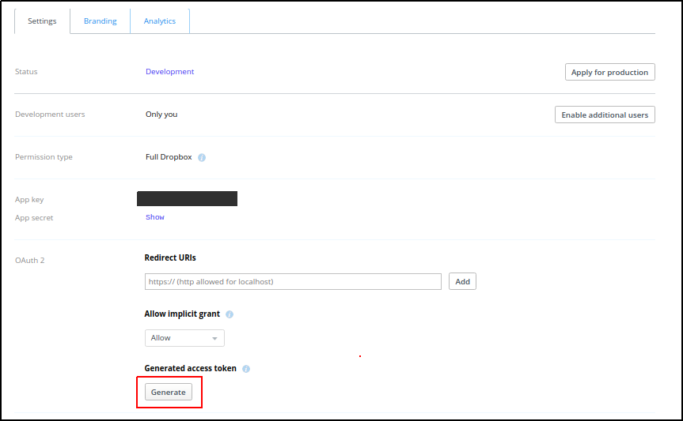

# How To Generate `access_token` For Dropbox

The current version `1.0` of **`miniBRS`** relies on user to generate an **`access_token`** for his dropbox account and register it with **`miniBRS`** via **`dropbox_default`** connection id. The process we describe here is out of convention, We understand that in an actual environment you would require **`miniBRS`** to have an OAuth handshaking with the **`Dropbox`** server and abstract all token generation mechanism for you, We are working on making things better for our users and at this moment for the current version we would require you to generate the **`access_token`** for your account manually. 

Here we shall be describing the steps for generating the **`access_token`** for your **`DropBox`** account. Let's get started

1. Hit the following URL  [www.dropbox.com/developers](https://www.dropbox.com/developers) in your browser.  Click on the `App Console` button on the top right side of the webpage, It will take you to the dropbox login page, If you are not logged in else you will be redirected to **`App Console`** webpage. Sign in with your credentials and proceed.
 
    
    
     
    
2. Once the login is success, a `Create app` button appears in the `App Console` page. 

     
    
    Click on the `Create app` button, You will see `DBX Platform` screen with various setting options listed. choose the values for the options as shown below: 
    
    * For **`Choose an Api`** option select `Dropbox API`. 
    * For **`Type Access`** select `Full Dropbox`. 
    * And in the last field choose any name for your `app`. 
    
     
    
     
    
     
    
    After selecting all options as shown above, click on the **`Create app`** button at the bottom right, This will create an  app for you. Once app is created by **`DBX platform`** you will be redirected to the **`App Console`** page and now you see  an entry for your created app. 
    
     
    
    
 
     
    
3. Click on the newly created app icon, In the `Settings` tab  hit the `Generate` button, This will generate a 64 character long **`access_token`**.
 
    
    
     
    
     Congratulation, you have successfully generated your token. Copy it and paste it into the `login field` of `dropbox_default` connection id in the `Airflow UI`. Now You have successfully registered your dropbox storage with **`miniBRS`**

