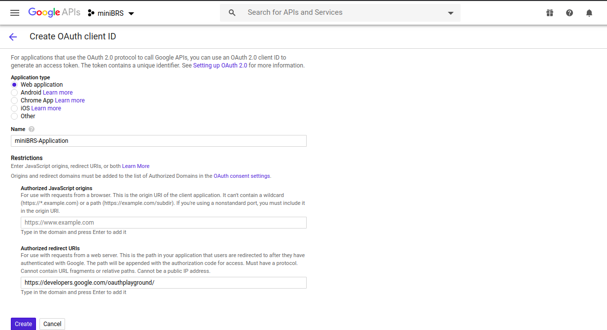

# How To Generate `access_token` For Google Drive
The current version `1.0` of **`miniBRS`** relies on the user to generate an **`access_token`** for his google drive account and register it with **`miniBRS`** via **`google_drive_default`** connection id. The process we describe here is out of the convention, We understand that in an actual environment you would require **`miniBRS`** to have an OAuth handshaking with the **`Google`** server and abstract all token generation mechanism for you, We are working on making things better for our users and at this moment for the current version we would require you to generate the **`access_token`** for your account manually. 

Here we shall be describing the steps for generating the **`access_token`** for your **`Google Drive`** account. Let's get started

The process of generating an **`access_token`** is two-fold, you would need to generate **`client ID`** and **`client secret`** first
and then using them you can generate the **`access_token`** and **`refresh_token`** for your account.
 
## Generate Google Drive client ID and secret
To generate client id and secret for Google Drive, follow the steps using your browser.

**Procedure**

1. Go to [Google API Console](https://console.developers.google.com) and select an existing project or create a new one. 
    In this example, we create a new project **`miniBRS`**.
    Click on **`CREATE PROJECT`**
    
    
    ---
    Enter the  **`Project Name`**, and click create. You will be redirected to the **`Dashboard`** screen.
      
    
    
2. Go to the Library page in the right panel, find Google Drive API and enable the Google Drive API that allows you to 
    access resources from Google Drive.
    
    
    
    ---
    
    
    
    ---
    
3. Go to the Credentials menu link, in the right panel. Click **`CONFIGURE CONSENT SCREEN`**, select **`User Type`** 
    as **`External`** and click **`CREATE`**. Set an Application name in the **`Application name`** field. In this example, 
    it is **`miniBRS-app`**. Try to use the unique application name, you can even place your name appended to the app name to make it unique. When done, click Save.
    
    ---
    
    
    
    ---
    
    
    
    ---
    
    
    
    ---
    
4. Click **`Credentials > +CREATE CREDENTIALS > OAuth client ID`**, and in the **`Create OAuth client ID`** page, 
    create a new client ID with Name **`miniBRS-Application`** with Application type set to **`Web application`**,
    and **`Authorized redirect URIs`** set as `https://developers.google.com/oauthplayground`

    
    
    ---
    
     
    
5. Click Create. You will be shown your client ID and client secret that you can use to generate **`access_token`** for your account
    
    
    
    ---
    
## Generate **`access_token`** for Google Drive using a client ID and secret

To generate **`access token`** to access Google Drive, you need to first generate the access token by completing the 
following steps using Google Developers OAuth Playground.

1. Go to [Google Developers OAuth Playground](https://developers.google.com/oauthplayground/)

     
    
2. Click OAuth 2.0 Configuration and select Use your own OAuth credentials checkbox, enter the OAuth client ID and client 
    secret you have already created in the OAuth Client ID and OAuth Client secret fields respectively.    

    
    
     
    
3. In OAuth 2.0 Playground Step 1, select the scope **`https://www.googleapis.com/auth/drive`** under Drive API v3 for the Google Drive API and click Authorize APIs, then click Allow to generate the authorization code. You will be redirected to your google account login page for authentication enter your login details and sign in to your account. During authentication
    your browser might show up **`This App isn't Verified`** warning screen, you can skip this warning by clicking on the 
    `Advanced` link at the bottom of the page and continue by accepting **`UnSafe`** mode. Don't worry this is not going to be any security issue as you are working with your app and you can trust yourself :)   
    
    
    
     
    
4. In OAuth 2.0 Playground Step 2, click Exchange authorization code for tokens to generate the OAuth access token.
    
    
    
    
   The OAuth access token is displayed on the right panel as shown in the below figure. copy the whole JSON structure and place
   it in the **`Extra`** field of **`google_drive_default`** connection id of miniBRS also enter generated **`client ID`**
   and **`secret`** respectively in the fields **`Login`** and **`Password`** of the **`google_drive_default`** connection id
   
    
   
    
   Congratulation, you have successfully integrated google drive!
    
   ---
    
