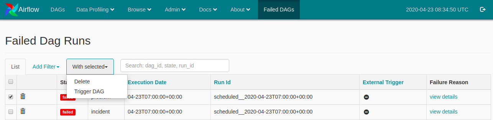

<H1>Recovery</H1>

Failure recovery is an important part of a system. **`miniBRS`** provides you with a mechanism to recover your failed dag runs.
In a production environment, A dag may fail because of multiple reasons which leads to the inconsistent data in the storage.
Dags generated by **`miniBRS`** have recovery option associated with them, In case a dag fails you have an option to rerun the 
dag for the same time interval in the past for which it failed.

##Failed DAG's

To see your failed DAGs and the reason behind their failure click on the **`Failed DAGs`** menu link present in
the nav-bar of the UI. This will show you a list of failed dags along with their **`execution_dates`** and a reason for
their failure. 

**Failed DAGs**

Click on the **`view_details`** option present under the **`Failure Reason`** column of the **`Failed DAGs`** view, To see
the reason of failure. If the failure reason falls under a know category list it will show you a friendly message else 
the stack trace of the exception will be shown

**Failure Reason**

Before, We describe you the process to recover your failed dag runs, It's worth remembering that **`miniBRS`** provides you
a single shot for the recovery process, make sure you resolve the issue that lead to the failure else it will fail again 
and you will be left with inconsistent data.

You can run a recovery dag from the **`Failed DAGs`** view, select the dag which you want to recover and click **`Trigger DAG`**
option under **`With Selected`** tab menu. The system will prompt you with a dialog box to confirm the selection, hit ok
and you will see that a recovery dag will be spawned for the selected failed dag. This dag will run and fetch the data for
the same interval for which it failed.

 

**Recovery DAG Run**

##Logs

For debugging and maintenance purpose you may need to check the logs of the **`DAGs`** and the associated **`Tasks`**. Logs 
can be seen for each DAG via UI, Airflow provides you an easy way to check out the Logs for each DAG and Task, you can use
the **`Graph View`** of the DAG to check the logs and status of each Task running or executed. 

Log files can be found in **`logs`** folder under **`miniBRS`** project folder. Logs will be present for only last 24 Hours,
This is because of **`dag_cleanup`** dag which deletes the logs on daily basis to free the storage space.  
