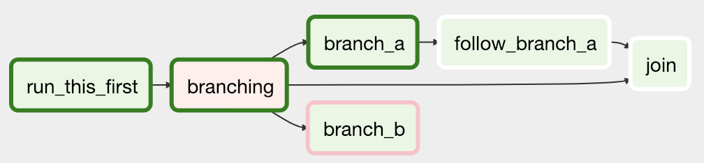
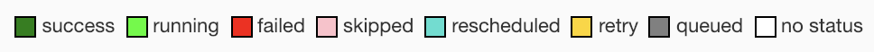
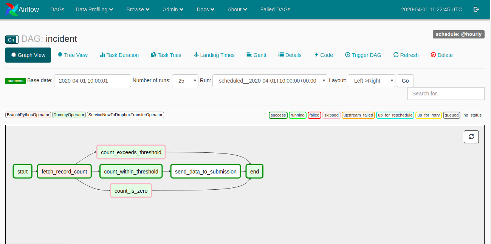
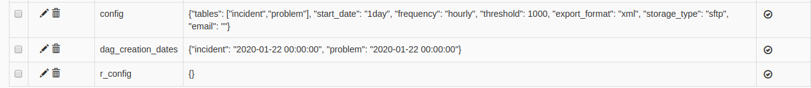

# Settings

miniBRS uses Apache Airflow for workflow management and monitoring. Apache Airflow is an open-source platform to programmatically author, schedule and monitor workflows. It provides a great UI for monitoring of your DAGs. When workflows are defined as 
code, they become more maintainable, versionable, testable, and collaborative. 

Before moving forward, It's important to know a few concepts specific to Apache Airflow. We are not going to get into the detailed
working of Apache Airflow, That is not the scope of this document. We shall be detailing out a few basic concepts necessary to know before using miniBRS. If you want to get in-depth of Airflow please checkout there documentation pages, you can find
the link in References[<sup> \[1\] </sup>](settings.md#references)


##Concepts

1. **DAG:** In Airflow, a DAG – or a Directed Acyclic Graph – is a collection of all the tasks you want to run, organized in a way that reflects their relationships and dependencies. A DAG is defined in a Python script, which represents the DAGs 
    structure (tasks and their dependencies) as code. 
    
    For example, a simple DAG could consist of three tasks: A, B, and C. It could say that A has to run successfully before B can run, but C can run anytime. It could say that task A times out after 5 minutes, and B can be restarted up to 5 times in case it fails. It might also say that the workflow will run every night at 10 pm, but shouldn’t start until a certain date. In this way, a DAG describes how you want to carry out your workflow
    
    *Example DAG*
    
    
    
    <br/>
    
2. **Tasks:** Tasks represent the actual piece of work that needs to be executed so that the workflow can progress and ultimately finish in its entirety. Each task is an independent idempotent job, by idempotent we mean that for given inputs the task should always finish its execution giving the same output every time. Tasks are represented by `Operators` in a `DAG`. Each `Operator`
    instantiation represents an independent task execution
    
    A task goes through various stages from start to completion. In the Airflow UI (graph and tree views), these stages 
    are displayed by a colour representing each stage:
    
    
    
    <br/>
    
3. **Connections :** The information needed to connect to external systems is stored in the Airflow meta database and can 
    be managed in the UI (Menu -> Admin -> Connections). A `conn_id` is defined there, and `hostname` / `login` / `password` / `schema` 
    information attached to it. Airflow pipelines retrieve centrally-managed connections information by specifying the relevant conn_id. 
    
    <br/>
    
4. **Variables:** Variables are a generic way to store and retrieve arbitrary content or settings as a simple key-value 
    store within Airflow. Variables can be listed, created, updated and deleted from the UI (Admin -> Variables)


##How to Use

`miniBRS` makes your workflow creation and management easy and customizable. Airflow at the backend helps in scheduling and 
monitoring of workflows, whereas `miniBRS` gives to configurable workflows at your disposal. `miniBRS` provides you with a set of
tested workflows maintained by the community, That helps you in getting your data backed up to a storage platform or seeded 
to your data store. In the current version of `miniBRS`, we have a variety of support for `Service Now` platform and new SaaS 
platforms are being added in new releases. 

Using `miniBRS` is a matter of few clicks, It makes your workflow creation painless. In this section, we shall describe how you
can configure your workflows. Make sure you check out [How It Works](how_it_works.md) document where a use case for Service Now
`incident` table is described. Without any further ado, Let's get started. 
 
##DAGs

A couple of DAGs come bundled with `miniBRS`, These are:

###Static DAGs

1. **dag_cleanup:** This dag is used to free the storage space. Execution of DAGs lead to a generation of multiple `temporary`
    files, variables and logs. This DAG helps in getting them off the system. It is being run on a `@daily` basis and It runs
    three tasks `remove_recovery_dags`, `remove_tmp_files` & `purge_logs`.
    
    `miniBRS` provides you with an option to recover your failed DAG executions. Each failed `dag` is recovered by creating another dag specific for the recovery purpose. Once the recovery is completed recovery_dags are removed by `dag_cleanup`.
    
    **Disclaimer: Default functioning of `dag_cleanup` gives you 24Hrs of time to have your failed dag execution recovered.**
    
    Please check [Logs](logs.md#failed-dags) section for more information about recovery process
    
    <br/>
    
2. **dag_generator:** This dag is used to generate your workflows using a `config` variable. It is hidden from the UI so that 
    but you can check its presence in the `dags` folder.

### Dynamic DAGs

`miniBRS` is capable of generating DAGs on the go. You can specify the configuration for your workflow in the `config` variable
and It will start generating dags based on the configured values. A dag is spawned for each `table` entry in the `config` 
variable. The generated dag will be named the same as `table name` in the `config`. and each dag will comprise of set of tasks
`start`, `fetch_record_count`, `count_exceeds_threshold`, `count_within_threshold`, `count_is_zero`, `send_dat_to_submission`
and `end`. Such a table named workflows is responsible for fetching your data from the SaaS platform such as Service Now.

Besides these `table named` dags, you will also see some dags starting with `r_` these dags are the recovery dags. Each recovery
dag will start its name with `r_` and then a table name and it ends with the failed execution DateTime.

This is a snapshot of DAGs UI


* **Graph View**: generated ServiceNow DAG's dependencies and their current status for a specific run.




## Connections
Before running any DAG, make sure you specify the requisite connections to the external services required for
the functioning of workflows.

The connections can be found via ``Admin`` tab in the navigation bar, Click on ``Admin`` tab and select ``Connections`` from the
drop-down menu, you will be redirected to airflow connections page, Airflow allows you to store your external connection
details in the meta database via this page. Few connections are of specific importance to miniBRS and you as a user have to make sure to configure these connections based on your specific needs. Let's have a look at few such connections.  

####servicenow_default: 
Is the connection entry in the meta database which will hold your Service Now instance credentials.
This connection is where you would store your Service Now instance URL and login credentials. If you edit this connection
by clicking on the edit connection icon, you will have a form with fields like ``conn Id``, ``conn type``, ``Host`` etc. 
please do not change the ``Conn Id`` value. Add your ServiceNow instance URL to ``Host`` field of the form, you need to 
add the URL with ``https`` appended e.g if your instance is `dev1234.service-now.com` save it as `https://dev1234.service-now.com` 
in the `Host` field of the form. Also, you need to add ServiceNow user name to `Log in` field and password to `Password` field of the form.

#### sftp_default:
If you want to ingest your SaaS data to an SFTP account, you can add the SFTP connection
details in `sftp_default` connection entry. Add sftp host IP in the ``Host`` field, sftp user name in the `Login` field and sftp user password in the `Password` field of the form, nothing else needs to be changed.

#### s3_default:
If you want to ingest your SaaS  data to Amazon S3 account, you need to have `access_key_id` 
and `secret_key_id` for your s3 storage. Add `access_key_id` to `Login` and `secret_key_id` to `Password` field of the 
`s3_default` connection. The default S3 region is `ap-south-1` and default bucket name is `mini-brs`, To change the default 
`region` and `bucket` name you need to add that to the extras field of the form. The extras field has a JSON string with
`region-name` and `bucket-name` as attributes, you can specify your region name and bucket name correspondingly  

#### dropbox_default:
miniBRS provides you with an option to ingest your SaaS data to `Dropbox`, for this you need to generate `access_token`
for your dropbox account and add that `access_token` to the `Password` field of the
connection. To generate `access_token` for you account please check out the following Reference[<sup> \[2\] </sup>](#references)

#### mysql_default:
This is a default connection used to store MySQL database credentials, If you want to use MySQL as a storage platform, you
can store your MySQL database credentials in this connection. Add your database hostname in `Host` field, database name to
`Schema` field, Username to `Log in` field, Password to `Password` field and port to `Port` field of the connection form

#### postgres_default:
This is a default connection used to store Postgres database credentials, If you want to use Postgres as a storage platform, you
can store your Postgres database credentials in this connection.

#### mssql_default:
This is a default connection used to store Microsoft SQL Server database credentials, If you want to use SQL Server as a 
storage platform, you can store your database credentials in this connection.

    Important Note:

        You do not need to provide every connection details defined above, 
        You need to provide only that connection detail which you want to use for storage purpose. Please note that you need to provide the 
        connection details for that storage which you have set in the 
        'storage_type' attribute of the 'config'  variable. If you have 
        placed 'storage_type:"sftp"' in 'config' variable, you must provide 
        the values to the 'sftp_default' connection.


## Variables
miniBRS uses `Variables` as a single point to configure workflows. Once you have installed miniBRS and added Service Now and storage connection details to the there respective connection ids, you can configure your workflows via configuration variables. Variables can be set via Airflow UI, click on `Admin` in the navbar, select Variables. You will see a list of variables. At any specific moment, there could be many variables generated by the system but among all those variables three are of core importance lets check them out.

.

Lets go through these variables one by one:

####config:
config variable is an important key-value pair in the meta-database, It provides you with a mechanism to generate workflows dynamically. 
It uses the JSON format to store values. You can `create` and `delete` DAGs using this variable. We shall define the working of
each attribute now.
```json
{
  "tables": ["incident","problem","sc_request"], 
  "start_date": "1day", 
  "frequency": "hourly", 
  "threshold": 10000, 
  "export_format": "xml", 
  "storage_type": "dropbox", 
  "email": ""
}
```

**Attributes**

 - **tables:** Is an array where you can add the Service Now table names as comma-separated-values from which you want to ingest data to the storage. Please ensure the values inside the table should be valid ServiceNow table names. For each table name in this array, a DAG will be generated with name same as the entry name. e.g If you add `incident` to the list, You will see a DAG named `incident` in the DAG UI. If you remove the `incident` entry from the list, 
    The corresponding dag for the entry will be deleted and so will be the tasks associated with it.
    
    <br/>
    
 - **start_date:** This attribute is used to set the `start_date` of the DAG. `start_date` of a DAG is an important setting 
    It provides you with a way to get historical data from your ServiceNow instance. It takes values of format `xday` or `xdays`, 
    where `x` is an integer value which specifies how many days ago should this DAG fetch the data from the source. e.g
    If you append `incident` value to the tables attribute at `2020-04-13 13:00:00 UTC` and set start_date to `2day` the generated incident dag will get data from `2020-04-11 00:00:00 UTC`. start_date along with frequency will help you in getting historical data. 
    
    <br/>
    
 - **frequency:** Refers to the schedule interval of the workflow. It can take value such as `half-hourly`, `hourly`, `daily` 
    etc. `frequency` states the periodicity of the DAG, i.e how often this workflow should be scheduled. e.g If you append 
    `incident` value to the tables attribute at `2020-04-13 12:00:00 UTC` and set start_date to `2day` and frequency as `hourly` 
    the generated incident dag will get data from `2020-04-11 00:00:00 UTC` to `2020-04-13 13:00:00 UTC` on an hourly basis i.e.
    its will run `incident` dag 61 times (48 times + 13 times) and each time it will get the data hourly wise first from
    `2020-04-11 00:00:00 UTC` to `2020-04-11 01:00:00 UTC` then from `2020-04-11 01:00:00 UTC` to `2020-04-11 02:00:00 UTC` and so on 
    
    `frequency` together with `start_date` helps you in getting historical data from your SaaS platform
    
    <br/>
    
 - **threshold:** ```threshold``` is used to specify the threshold of records fetched from the ServiceNow instance. By default it is placed at its maximum value of 10000, placing a value greater than 10000 is not going to do any good, if the number of data records for a specific run exceeds the threshold, No data will be fetched for that period. In that case, try to change 
    the ```frequency``` of your workflow to some lower value.
    
    <br/>
    
 - **export_type:** ```export_type``` is used to specify the format of data to be stored in the storage, default is ```xml```.
    currently, we only support `xml` format
    
    <br/>
    
 - **storage_type:** ```storage_type``` is used to specify the type of storage to be used for ingesting data, currently, miniBRS 
    supports AmazonS3, DropBox, SFTP, MySQL, Postgres and SQL Server. The credentials of these storages are to be stored in Airflow Connections in their specific default connection_ids.
    
    <br/>
    
 - **email:** If you have configured SMTP server details during installation or you have manually set them in
 ```airflow.cfg``` file then you can specify the email_address here to which the failure alerts should be sent.
    
 The other two variables ```dag_creation_dates``` and ```r_config``` are meant for internal usage, their presence is
 necessary for normal functioning of miniBRS.

## Notifications

`miniBRS` provides failure alert notification via `emails`, we use Airflow's built-in mechanism for failure alerting to alert users about workflow failures. Installation of `miniBRS` accompanies configuring of SMTP server for email alerting 
If you have chosen to install miniBRS via installer script, then you might have been prompted for email configuration setup.
If you have configured SMTP server rightly you would be receiving alerts about the failed dags in your registered email.
which you have provided in the `config` variable.

In case, you haven't configured email client at the time of installation, you can do it now. To receive email notifications
you must have an Email Server or an email provider e.g Gmail, Outlook etc. Here we will brief you about setting up a Gmail
email account as a email client, a similar process could be used for your specific provider.

In order to use Gmail for sending notifications, you need to generate `app_password` for your email account. If you already have
app_password then you can proceed else checkout the References[<sup> \[3\] </sup>]() link to generate app_password for Gmail account.

**`app_password` is used so that you don't use your original password or 2 Factor authentication**

1. Open `airflow.cfg` file from the `miniBRS` project folder
        
        ~$ nano airflow.cfg
        
2. Search the file for `[smtp]` section, It would be looking somewhat this, set the corresponding values for the `attributes` and save the file
        
        [smtp]
        smtp_host = smtp.gmail.com              # Place your SMTP host here
        smtp_starttls = True                    # Keep this as True only
        smtp_ssl = False                        # Keep this as False only
        smtp_user = YOUR_EMAIL_ADDRESS          # Enter your email address
        smtp_password = 16_DIGIT_APP_PASSWORD   # Enter your app password
        smtp_port = 587                         # This is default SMTP port
        smtp_mail_from = YOUR_EMAIL_ADDRESS     # Enter your email address 
        
    
    
   
3. That's it you have an email client configured, Now restart airflow  webserver and scheduler

4. To receive an email notification, you need to tell `miniBRS` where to send notifications. This is done via `config`
    variable. Set the`email` attribute of the `config` variable with the recipient email address, which is to be notified.
        
        


## References

* [Apache Airflow : Documentation](https://airflow.apache.org/docs/stable)
* [Generate DropBox Access Token](#)
* [Generate Gmail App Password](https://support.google.com/accounts/answer/185833?hl=en)
